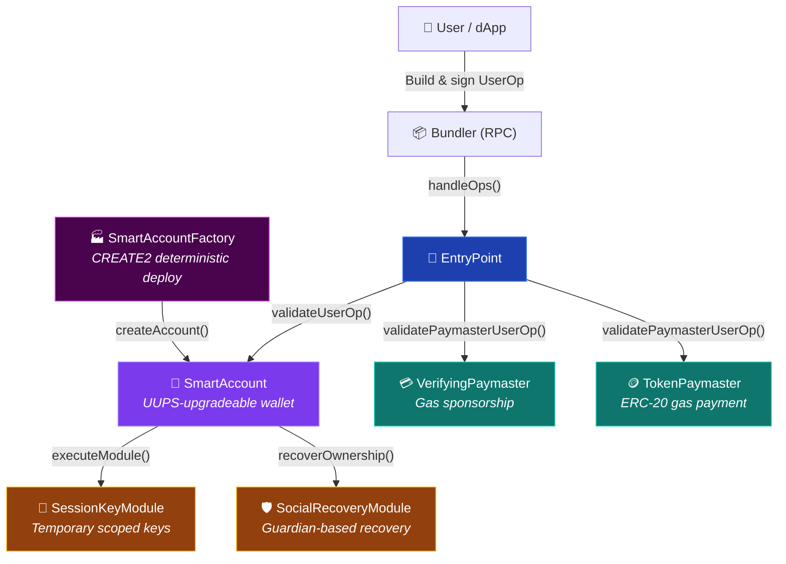

# Smart Wallets

A production-grade ERC-4337 Account Abstraction implementation featuring smart contract wallets, gas sponsorship paymasters, session keys, and guardian-based social recovery.

## Architecture



## UserOperation Workflow

```mermaid
sequenceDiagram
    participant dApp
    participant SDK as Client SDK
    participant Bundler
    participant EP as EntryPoint
    participant Paymaster
    participant Account as SmartAccount

    rect rgb(30, 27, 75)
    Note over dApp,SDK: 1 — Build UserOperation
    dApp->>SDK: Build callData (execute/batch)
    SDK->>SDK: Estimate gas limits
    SDK->>SDK: Sign UserOp with owner key
    end

    rect rgb(20, 50, 60)
    Note over SDK,Bundler: 2 — Submit to Bundler
    SDK->>Bundler: eth_sendUserOperation(userOp, entryPoint)
    Bundler->>Bundler: Local validation & simulation
    end

    rect rgb(30, 58, 38)
    Note over Bundler,Account: 3 — On-Chain Execution
    Bundler->>EP: handleOps([userOp])
    EP->>Account: validateUserOp(userOp, missingFunds)
    Account-->>EP: validationData (signature OK)

    alt Gas Sponsored
        EP->>Paymaster: validatePaymasterUserOp()
        Paymaster-->>EP: Approved (signature valid)
    end

    EP->>Account: execute(target, value, data)
    Account->>Account: Call target contract
    end

    rect rgb(55, 48, 20)
    Note over Bundler,EP: 4 — Settlement
    EP-->>Bundler: UserOperationEvent emitted
    Bundler-->>SDK: userOpHash receipt
    SDK-->>dApp: Transaction confirmed
    end
```



## Features

| Feature | Contract | Description |
|---------|----------|-------------|
| Smart Wallet | `SmartAccount` | UUPS-upgradeable ERC-4337 wallet with execute/batch |
| Deterministic Deploy | `SmartAccountFactory` | CREATE2 factory for predictable wallet addresses |
| Gas Sponsorship | `VerifyingPaymaster` | Off-chain signer authorizes gas sponsorship |
| Token Gas Payment | `TokenPaymaster` | Pay gas fees with ERC-20 tokens |
| Session Keys | `SessionKeyModule` | Temporary scoped keys for dApp interaction |
| Social Recovery | `SocialRecoveryModule` | Guardian-based wallet recovery with time-lock |

## Quick Start

### Prerequisites

- Node.js v18+
- npm v9+

### Installation

```bash
npm install
```

### Compile Contracts

```bash
npx hardhat compile
```

### Run Tests

```bash
npx hardhat test
```

### Run Tests with Coverage

```bash
npm run test:coverage
```

### Run Tests with Gas Reporting

```bash
REPORT_GAS=true npx hardhat test
```

### Deploy (Local)

```bash
npx hardhat run scripts/deploy-factory.js
```

### Deploy (Sepolia)

```bash
cp .env.example .env
# Edit .env with your keys
npx hardhat run scripts/deploy-factory.js --network sepolia
```

## Project Structure

```
contracts/
├── core/
│   ├── SmartAccount.sol          # ERC-4337 smart wallet
│   ├── SmartAccountFactory.sol   # CREATE2 account factory
│   └── EntryPointSimulator.sol   # Local testing EntryPoint
├── paymasters/
│   ├── VerifyingPaymaster.sol    # Signature-based sponsorship
│   └── TokenPaymaster.sol       # ERC-20 gas payment
├── modules/
│   ├── SessionKeyModule.sol     # Temporary session keys
│   └── SocialRecoveryModule.sol # Guardian recovery
├── mocks/
│   ├── MockERC20.sol            # Test token
│   └── MockOracle.sol           # Test price oracle
└── libraries/
    └── AccountErrors.sol        # Custom errors

sdk/
├── userOpBuilder.js    # Build & sign UserOperations
├── bundlerClient.js    # Bundler JSON-RPC client
├── paymasterClient.js  # Paymaster signature helpers
├── accountClient.js    # Smart account utilities
└── index.js            # Barrel exports

scripts/
├── deploy-factory.js             # Deploy factory
├── deploy-verifying-paymaster.js # Deploy VerifyingPaymaster
├── deploy-token-paymaster.js     # Deploy TokenPaymaster
└── create-account.js             # Create smart account

test/
├── SmartAccount.test.js
├── SmartAccountFactory.test.js
├── VerifyingPaymaster.test.js
├── TokenPaymaster.test.js
├── SessionKeyModule.test.js
├── SocialRecoveryModule.test.js
├── Integration.test.js
└── Security.test.js            # Vulnerability analysis tests
```

## Security Features

### Contract Hardening

| Contract | Guard | Description |
|----------|-------|-------------|
| `SmartAccount` | Empty batch | Rejects `executeBatch([])` |
| `SmartAccount` | Module self-enable | Prevents enabling `address(this)` as module |
| `SmartAccount` | Withdraw guard | Rejects withdrawal to `address(0)` |
| `SmartAccount` | Double init | `initialize()` callable only once |
| `SmartAccountFactory` | Zero-address owner | Rejects `createAccount(address(0), salt)` |
| `SessionKeyModule` | Zero-key guard | Rejects `registerSessionKey(address(0), ...)` |
| `SessionKeyModule` | Time window | Rejects `validUntil <= validAfter` |
| `SessionKeyModule` | Duplicate guard | Rejects re-registering active key |
| `SocialRecoveryModule` | Self-guardian | Prevents adding self as guardian |
| `SocialRecoveryModule` | Max guardians | Cap at 10 to prevent unbounded gas |
| `TokenPaymaster` | Config bounds | Rejects zero-address token/oracle, markup 0% or >200% |
| `TokenPaymaster` | Withdraw guard | Rejects withdrawal to `address(0)` |

### Vulnerability Tests (38 tests)

| Category | Tests | Vectors Covered |
|----------|-------|-----------------|
| SmartAccount | 11 | Empty batch, module spoofing, double init, upgrade auth, self-transfer, revert propagation |
| SmartAccountFactory | 2 | Zero-address owner, idempotent deploy |
| SessionKeyModule | 6 | Zero key, invalid time, duplicate, cross-account, revoke+re-register |
| SocialRecoveryModule | 6 | Self-guardian, max cap, re-initiate clears state, cancel cleanup, threshold adjustment |
| TokenPaymaster | 7 | Zero-address config, zero/excessive markup, withdraw guard |
| VerifyingPaymaster | 4 | Zero-address signer, construction guard, hash consistency |
| Replay Prevention | 2 | Nonce-based hash uniqueness, nonce tracking |

### Static Analysis

```bash
# Install Slither (requires Python)
pip3 install slither-analyzer

# Run analysis
npm run audit:slither
```

## SDK Usage Examples

### Build and Sign a UserOperation

```javascript
const { buildUserOp, signUserOp } = require("./sdk");

const userOp = buildUserOp({
  sender: accountAddress,
  nonce: 0n,
  callData: encodedCallData,
});

const signed = await signUserOp(userOp, signer, entryPointAddress, chainId);
```

### Submit to a Bundler

```javascript
const { BundlerClient } = require("./sdk");

const bundler = new BundlerClient("https://api.stackup.sh/v1/node/YOUR_KEY");
const hash = await bundler.sendUserOperation(signed, entryPointAddress);
const receipt = await bundler.waitForUserOperationReceipt(hash);
```

### Generate Paymaster Signature

```javascript
const { signPaymasterData, encodePaymasterData } = require("./sdk");

const signature = await signPaymasterData({
  userOp, signer, paymasterAddress,
  validUntil: Math.floor(Date.now()/1000) + 3600,
  validAfter: 0,
  chainId: 11155111,
});

const paymasterAndData = encodePaymasterData({
  paymasterAddress, validUntil, validAfter, signature,
});
```

## Dependencies

- [OpenZeppelin Contracts](https://github.com/OpenZeppelin/openzeppelin-contracts) — Access control, ECDSA, ERC-20, proxy patterns
- [eth-infinitism/account-abstraction](https://github.com/eth-infinitism/account-abstraction) — ERC-4337 reference interfaces (`BaseAccount`, `BasePaymaster`, `IEntryPoint`)
- [Hardhat](https://hardhat.org/) — Development framework

## License

MIT
